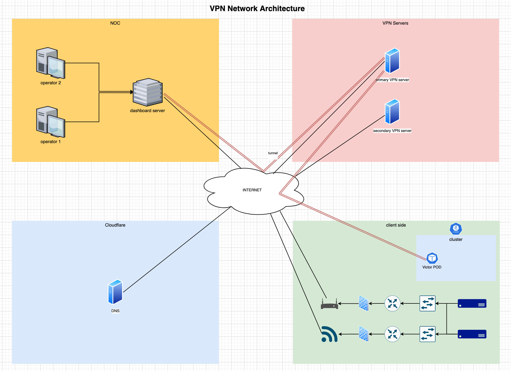

**Installation**

The openVPN network contains a client site, vpn server and operation center, as the below figure shows. This instruction connects these three entities through private IPs.



**Prerequisite**

Install openVPN and flask in the vpn server.
Install openVPN and docker in the client site and network operation center.

run the webserver on VPN server:

```
cd config
nohup sudo flask run --host=192.168.112.1 --port=80 &
```

connect openVPN to server from operation center's host:

```
<execute the command in operation center>
cd config
sudo openvpn --config client_c1.ovpn --daemon
```

to create new config file ( for client site ):
```
<execute in operation center>
curl 192.168.112.1:80/create/client_site1 > client_c1.ovpn
```

put `client_c1.ovpn` on specific dir on client site's host and run the container :

```
sudo docker run --name=client_ovpn --cap-add NET_ADMIN --device=/dev/net/tun -v <path to dir>:/etc/openvpn/ registry.gitlab.com/cbiot/backend/openvpn/network:latest
```

now start the service for connecting a specific client site to VPN server by run these command on the operation center:
```
curl 192.168.112.1/start/client_site1
```

now you should be able to communicate from operation center to client site by IP address that defined in `client_site1.ovpn` ( first line )
